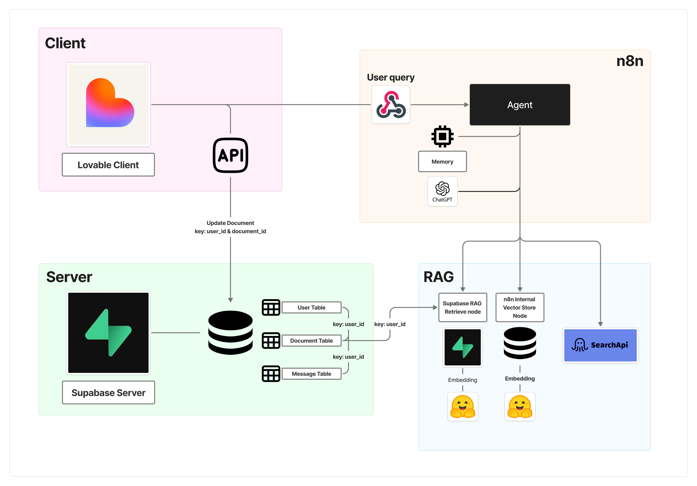
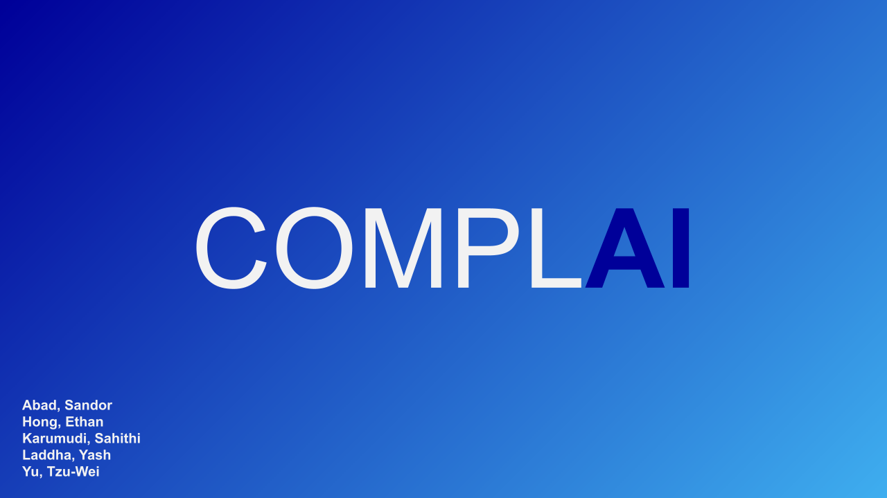

# COMPL-AI

* This project is follow - up improvement of the following project. For the general workflow / product information, refer to: [ADA & Legal Helper )

# Improvement
* Previous project was relying on in-n8n document store, storing single PDF document & Internet search for RAG. However, in terms of user experience, different users need different legal advices. 

* Therefore, by building user DB with user / documents/ messages table, new system enables customers to upload / collect their own legal reference documents for this RAG system. 

# Product Introduction

.png)

.png)

.png)

.png)

.png)

.png)

**🔗[App link](https://compl-ai.lovable.app/)**